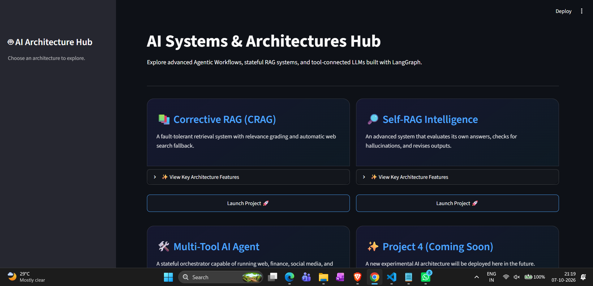
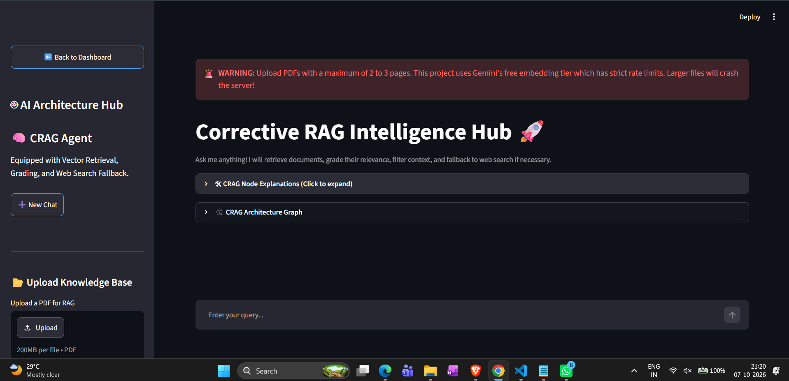
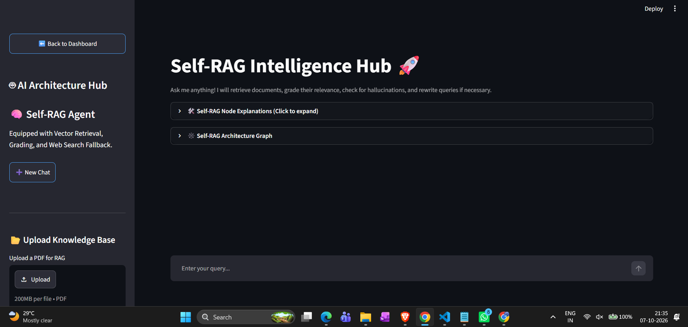
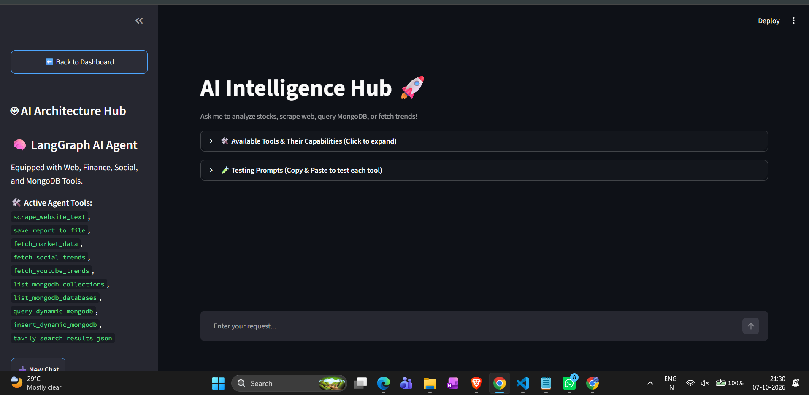

# LangGraph Multi-Agent Workflow 🤖

An enterprise-grade, unified AI Systems Hub hosting advanced Agentic Workflows, Self-Reflective RAG pipelines, and Autonomous Tool-Connected Agents.

Built with LangGraph, LangChain, Google Gemini, FAISS, MongoDB, and Streamlit, this project consolidates multiple state-of-the-art AI architectures into a single interactive dashboard with real-time state visualization, fallback resiliency, and persistent cross-session memory.

## 📸 Application Previews

*(Replace file paths in the `assets/` directory with your actual image filenames)*

### Main Dashboard Hub


### Corrective RAG (CRAG)



### Self-RAG Intelligence


### Multi-Tool AI Research Agent



## 🌟 Core Architectures & Features

### 1. 📚 Corrective RAG (CRAG) Intelligence

An agentic retrieval workflow designed to eliminate poor generation results caused by irrelevant context.

- **Document Relevance Evaluator:** Grades retrieved FAISS chunks on a strict scale (0 to 1) and filters out noisy context.
- **Query Rewriter:** Automatically optimizes vague or poorly matched queries when local document retrieval falls short.
- **Tavily Web Search Fallback:** Intelligently fetches real-time web knowledge if local documents are insufficient.
- **Dual Fallback System:** Uses primary/secondary Gemini API keys and seamlessly switches to local HuggingFace embeddings (all-MiniLM-L6-v2) if external embedding APIs fail or hit rate limits.

### 2. 🔎 Self-RAG Intelligence Hub

An advanced self-reflective state machine that critiques and refines its own reasoning before delivering an answer.

- **Semantic Router (decide_retrieval):** Determines whether a query requires external document retrieval or standard LLM reasoning.
- **Context Relevance Grader (is_relevant):** Verifies if retrieved text chunks directly address the prompt.
- **Hallucination Grader (is_sup):** Validates that every claim in the generated answer is strictly supported by source documents.
- **Usefulness Checker (is_use):** Evaluates whether the generated answer solves the user's core intent; triggers a revision loop if incomplete.

### 3. 🛠️ Multi-Tool AI Research Agent

A stateful, autonomous research assistant connected to 7 real-time external tools:

- **Web Scraper (BS4):** Extracts clean text content from web URLs.
- **Tavily Web Search:** Pulls real-time web search facts and news.
- **Market Data (yfinance):** Fetches real-time ticker prices, market caps, and financial ratios.
- **Reddit Trends (PRAW):** Retrieves hot discussions across subreddits via official Reddit APIs.
- **YouTube Trends:** Searches top trending video topics using YouTube Data API v3.
- **Dynamic MongoDB Master:** Reads, writes, and queries any collection across a MongoDB cluster via natural language.
- **Report Generator:** Formats research findings into temporary Markdown files and exposes instant browser downloads via Streamlit.
- **Persistent State Memory:** Powered by SQLite Checkpointing (langgraph-checkpoint-sqlite) for multi-turn conversational context.

## 🏗️ System Architecture & Routing Flow

```text
                                 ┌────────────────────────┐
                                 │  Streamlit Dashboard   │
                                 │        (app.py)        │
                                 └───────────┬────────────┘
                                             │
               ┌─────────────────────────────┼─────────────────────────────┐
               ▼                             ▼                             ▼
   ┌───────────────────────┐     ┌───────────────────────┐     ┌───────────────────────┐
   │    Corrective RAG     │     │       Self-RAG        │     │    Multi-Tool Agent   │
   │  (corrective_rag/)    │     │      (self_rag/)      │     │      (tool_llm/)      │
   └───────────┬───────────┘     └───────────┬───────────┘     └───────────┬───────────┘
               │                             │                             │
    ┌──────────┴──────────┐       ┌──────────┴──────────┐       ┌──────────┴──────────┐
    │ - Document Grading  │       │ - Hallucination     │       │ - yfinance / PRAW   │
    │ - Query Rewrite     │       │   Verification      │       │ - YouTube / Tavily  │
    │ - Tavily Search     │       │ - Usefulness Check  │       │ - MongoDB Master    │
    │ - Gemini/HF Fallback│       │ - FAISS Store       │       │ - SQLite Memory     │
    └─────────────────────┘       └─────────────────────┘       └─────────────────────┘
```

## 📁 Repository Structure

```text
LangGraph-Multi-Agent-Workflow/
│
├── assets/                     # Architecture diagrams and UI screenshots
│   ├── dashboard_preview.png
│   ├── crag_architecture.png
│   ├── self_rag_flow.png
│   └── tool_agent_ui.png
│
├── corrective_rag/             # Corrective RAG Module
│   ├── __init__.py
│   ├── crag_backend.py
│   └── crag_frontend.py
│
├── self_rag/                   # Self-Reflective RAG Module
│   ├── __init__.py
│   ├── langgraph_backend.py
│   └── langgraph_frontend.py
│
├── tool_llm/                   # Multi-Tool Research Agent Module
│   ├── __init__.py
│   ├── langgraph_tool_backend.py
│   └── streamlit_frontend_tool.py
│
├── app.py                      # Main Streamlit Dashboard & Routing Application
├── requirements.txt            # Python Dependencies
├── .env                        # Environment Secrets (API Keys)
└── README.md                   # Project Documentation
```

## 🛠️ Tech Stack

| Category | Technologies |
|---|---|
| LLM Engine | Google Gemini 3.5 Flash-Lite (via langchain-google-genai) |
| Orchestration | LangGraph, LangChain Core, LangChain Community |
| Frontend UI | Streamlit |
| Vector DB & Embeddings | FAISS, HuggingFace (all-MiniLM-L6-v2), Google Generative AI Embeddings |
| External APIs | Tavily Search API, Yahoo Finance (yfinance), Reddit API (praw), YouTube Data API v3 |
| Databases | MongoDB (PyMongo), SQLite (langgraph-checkpoint-sqlite) |
| Utilities | BeautifulSoup4, Pydantic, Python-Dotenv, PyPDF |

## 🚀 Local Installation & Setup

### 1. Prerequisites

Ensure you have Python 3.10 or higher installed.

### 2. Clone the Repository

```bash
git clone https://github.com/your-username/LangGraph-Multi-Agent-Workflow.git
cd LangGraph-Multi-Agent-Workflow
```

### 3. Create & Activate a Virtual Environment

**Windows:**

```bash
python -m venv venv
venv\Scripts\activate
```

**macOS / Linux:**

```bash
python3 -m venv venv
source venv/bin/activate
```

### 4. Install Dependencies

```bash
pip install -r requirements.txt
```

### 5. Configure Environment Variables

Create a `.env` file in the root directory:

```text
# Gemini API Keys (Primary & Fallback)
GEMINI_API_KEY=your_primary_gemini_key
GEMINI_API_KEY_2=your_fallback_gemini_key
GEMINI_API_KEY_TOOL=your_gemini_tool_key

# Search & Social Media APIs
TAVILY_API_KEY=your_tavily_api_key
REDDIT_CLIENT_ID=your_reddit_client_id
REDDIT_CLIENT_SECRET=your_reddit_client_secret
YOUTUBE_API_KEY=your_youtube_api_key

# Database Connections
MONGODB_URI=your_mongodb_cluster_connection_string
```

### 6. Run the Application

Launch the unified Streamlit hub:

```bash
streamlit run app.py
```

## ☁️ Streamlit Community Cloud Deployment

Push your repository to GitHub (ensure `.env`, `venv/`, and `*.db` files are in `.gitignore`).

Log in to Streamlit Community Cloud and create a New app.

Select your repository, set branch to `main`, and main file path to `app.py`.

Open **Advanced Settings... -> Secrets** and paste your `.env` key-value pairs in TOML format:

```toml
GEMINI_API_KEY = "your_primary_gemini_key"
GEMINI_API_KEY_2 = "your_fallback_gemini_key"
GEMINI_API_KEY_TOOL = "your_gemini_tool_key"
TAVILY_API_KEY = "your_tavily_api_key"
REDDIT_CLIENT_ID = "your_reddit_client_id"
REDDIT_CLIENT_SECRET = "your_reddit_client_secret"
YOUTUBE_API_KEY = "your_youtube_api_key"
MONGODB_URI = "your_mongodb_connection_string"
```

Click Deploy!

## 👨‍💻 Author

**Aditya Singh**

B.Tech in Electronics & Communication Engineering (ECE), MANIT Bhopal

💼 LinkedIn: thakuraditya05  
💻 GitHub: thakuraditya05  
🌐 Portfolio: thakur-aditya05.vercel.app

## 📝 License

This project is licensed under the MIT License.
